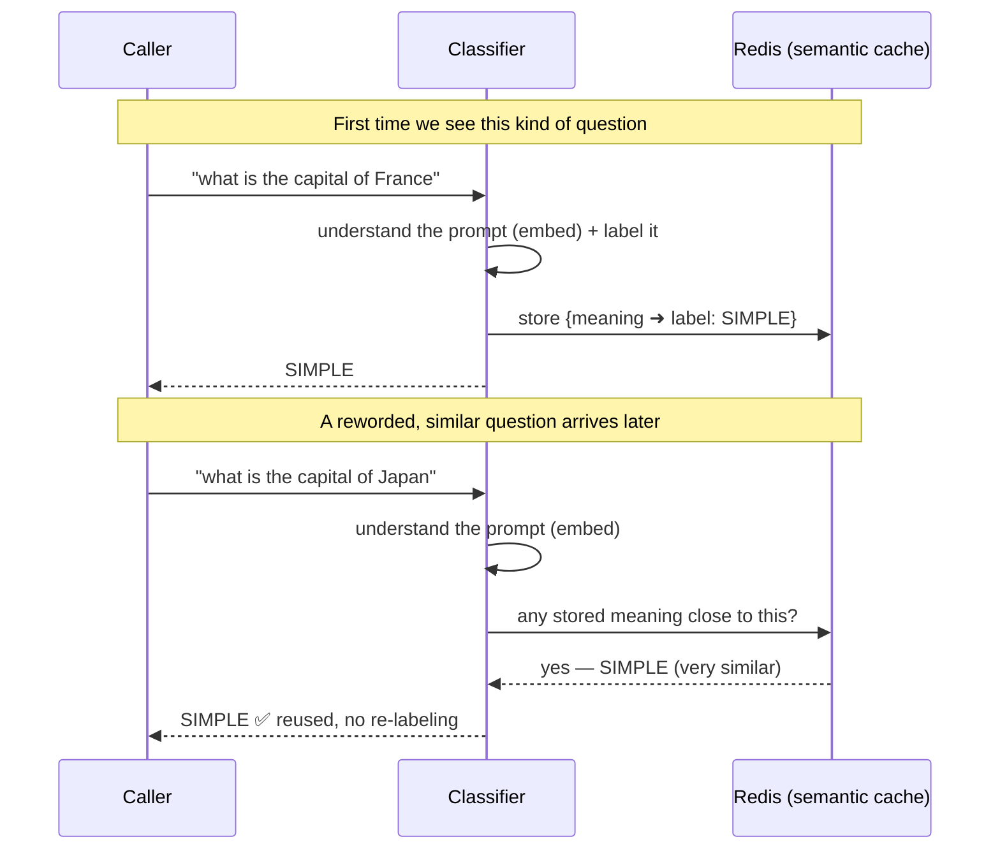
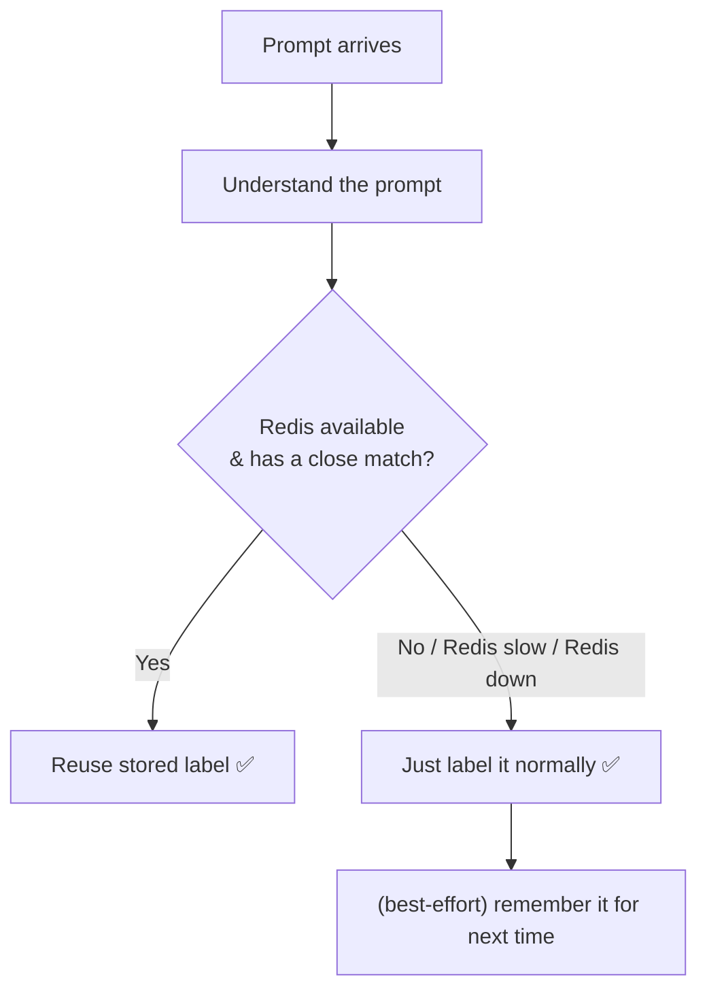

# Semantic Cache Classifier — Stakeholder Overview

*A plain-language summary of the change, for a non-implementation audience.*

## The one-sentence version

We are adding an **optional, off-by-default "semantic cache"** so that prompts
that *mean the same thing* reuse a previously computed label — instead of only
reusing labels for prompts that are **character-for-character identical**.

## What we have today vs. what we're adding

Today the classifier has a **1:1 (exact) cache**: it only reuses a result when a
new prompt is *byte-for-byte identical* to one it saw before. Reword the prompt
even slightly and it's treated as brand new.

The new tier adds **meaning-based reuse** on top of that, backed by Redis.

```mermaid
flowchart LR
    subgraph Today["Today — exact cache only"]
        A1["what is the capital of France"] -->|exact match| C1[("cache")]
        A2["what is the capital of Japan"] -.->|NO match<br/>(different text)| C1
        A2 --> R1["run classifier again"]
    end

    subgraph New["With semantic cache"]
        B1["what is the capital of France"] -->|stored: SIMPLE| C2[("Redis<br/>semantic cache")]
        B2["what is the capital of Japan"] -->|close in meaning| C2
        C2 -->|reuse: SIMPLE| B2
    end
```

## The worked example (the France → Japan story)



**Plain English:** the first question is labeled `SIMPLE` and its *meaning* is
remembered. The second question is different words but the same kind of ask, so
the system recognizes it's close and returns `SIMPLE` from the cache.

## What this buys us

| Benefit | What it means for stakeholders |
|---|---|
| **Higher reuse ("hit rate")** | Reworded / paraphrased prompts now reuse labels instead of being re-processed. |
| **Persistence & sharing** | Labels live in Redis, so they survive restarts and can be shared — unlike today's memory-only cache that's lost on restart. |
| **Consistency** | Similar prompts get the same label, reducing "why did these two similar prompts get labeled differently?" surprises. |

## What it is *not* (setting expectations honestly)

- It is **off by default.** Nothing changes for existing deployments until we
  explicitly turn it on. Turning it off is a single setting.
- It is **not a correctness guarantee.** Two prompts that look similar could
  occasionally get the same label when they arguably shouldn't. For our use case
  (labels are advisory), that trade-off is acceptable and tunable via a
  similarity threshold.
- It does **not** remove the core work of understanding a prompt — that step
  still runs. The saving is on the *labeling* step and, more importantly, the
  *reuse* and *consistency* across similar prompts.

## Reliability — "what if Redis goes down?"

This is designed so **Redis can never take the classifier down**. Redis is a
best-effort accelerator, not a dependency.



If Redis is slow or unavailable, the system automatically **falls back to
labeling normally** — with a safety switch (a "circuit breaker") that stops
even trying Redis for a short cool-down, so an outage never slows every request.

## How we control it

| Control | Purpose |
|---|---|
| On/off switch | Enable or disable the whole semantic tier (default: **off**). |
| Similarity threshold | How "close in meaning" two prompts must be to count as a match — higher = safer/fewer reuses, lower = more reuses. |
| Expiry (TTL) | Cached labels automatically age out so the cache stays fresh and bounded. |

## Rollout shape

1. Ship it **off by default** — zero change to current behavior, fully verified.
2. Turn it on in a **single, moderate-scale service** with one Redis, watch the
   reuse rate and a sample of label quality.
3. Tune the similarity threshold from real traffic.
4. If we ever outgrow this, the Redis piece is behind a clean seam, so moving to
   a larger/shared setup later is a swap, not a rewrite.

## Where the detail lives

- **Design rationale & trade-offs:** `docs/superpowers/specs/2026-08-30-semantic-cache-classifier-design.md`
- **Step-by-step build plan:** `docs/superpowers/plans/2026-08-30-semantic-cache-classifier.md`
